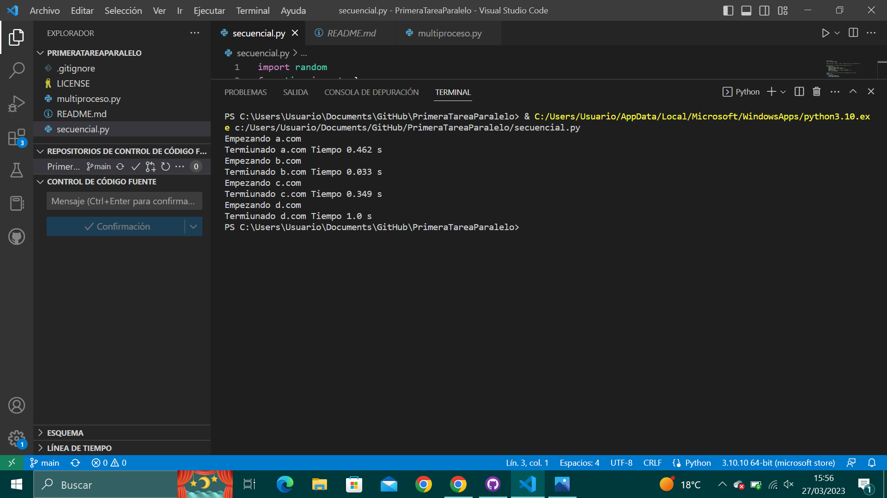

# PrimeraTareaParalelo
He realizado la primera actividad de programación en paralelo, de las dos maneras que se explican, comentando el proceso.

La dirección de github de este repositorio es la siguiente: [GitHub](https://github.com/AnaLopezP/PrimeraTareaParalelo.git)

https://github.com/AnaLopezP/PrimeraTareaParalelo.git

El código es el siguiente:
# Secuencial
```
import random
from time import sleep

urls = ['a.com', 'b.com', 'c.com', 'd.com'] #Lista con las supuestas urls

#Funcion que da un tiempo de duración aleatorio por url
def links(url):
    print('Empezando', url)
    duracion = round(random.random(), 3)
    sleep(duracion)
    print('Termiunado', url, 'Tiempo', duracion, 's')
    return url, duracion

#Añadimos las urls con su duracion de procesamiento en una lista
salida = []
for url in urls:
    resultado = links(url)
    salida.append(resultado)
```

# Multiproceso
```
from multiprocessing import Pool
import random
from time import sleep

urls =  ['a.com', 'b.com', 'c.com', 'd.com', 'e.com'] #Lista con las supuestas urls, añadimos una nueva url

#Funcion que da un tiempo de duracion aleatorio por url (reciclado)
def links(url):
    print('Empezando', url)
    duracion = round(random.random(), 3)
    sleep(duracion)
    print('Termiunado', url, 'Tiempo', duracion, 's')
    return url, duracion

if __name__ == '__main__':
    piscina = Pool(processes = 4) #Como tenemos 4 procesos y 5 urls, primero hará las 4 primeras a la vez, y luego la última que queda (como por lotes)
    datos = piscina.map(links, urls) #guarda la salida de cada llamada a la funcion

    piscina.close() #cerramos los procesos
    print() #Espacio

    for row in datos: #printeamos los datos almacenados en datos 
        print(row)
       
```
Las capturas del resultado:

